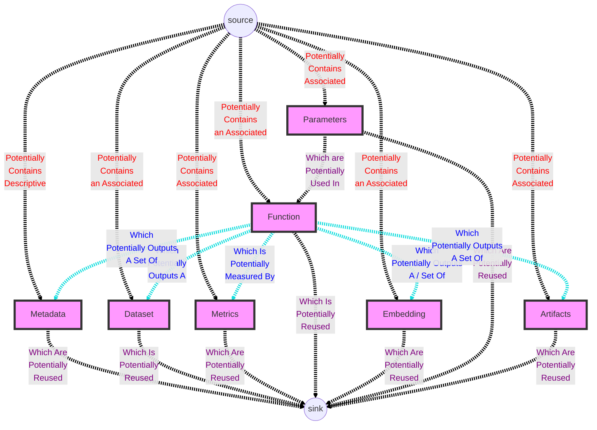

# Thing Graph

The Thing Store is capable of representing arbitrary data and at varying levels of resolution.

It's Things all the way down, all levels of which can be represented as a graph:

* A single Thing
* A workflow consisting of Things linked together
* A complex set of Things in a data layer

## Thing Node Graph

A Thing Node graph contains just the Things and their components which are used within a single 'node' within the Thing Store. It demonstrates the flow of information within a single Thing.

These contained Things and components might *not* just be within a single Thing and / or ThingStore.

A Thing might be local, or it might be distributed and remote.

Simple

Simple Graphical Visualization

Increased Granularity

```mermaid
flowchart TD
    %%Here are edges and links to fill the highest level of the graph
    SOURCE((source))
    SOURCE -. Potentially\nContains\nDescriptive .-> Metadata
    SOURCE -. Potentially\nContains\nan Associated .-> Dataset
    SOURCE -. Potentially\nContains\nAssociated .-> Metrics
    SOURCE -. Potentially\nContains\nan Associated .-> Function
    SOURCE -. Potentially\nContains\nan Associated .-> Embedding
    SOURCE -. Potentially\nContains\nAssociated .-> Parameters
    SOURCE -. Potentially\nContains\nAssociated .-> Artifacts
    Metadata:::Component -. Which Are\nPotentially\nReused .-> SINK
    Dataset:::Component -. Which Is\nPotentially\nReused .-> SINK
    Metrics:::Component -. Which Are\nPotentially\nReused .-> SINK
    Function:::Component -. Which Is\nPotentially\nReused .-> SINK
    Embedding:::Component -. Which Are\nPotentially\nReused .-> SINK
    Parameters:::Component -. Which Are\nPotentially\nReused .-> SINK
    Artifacts:::Component -. Which Are\nPotentially\nReused .-> SINK
    SINK((sink))
    %%This is a *functional* Thing
    Parameters -. "Which are\nPotentially\nUsed In" .-> Function
    Function -. Which\nPotentially\nOutputs A .-> Dataset
    Function -. Which Is\nPotentially\nMeasured By .-> Metrics
    Function -. Which\nPotentially Outputs\nA / Set Of .-> Embedding
    Function -. Which\nPotentially Outputs\nA Set Of .-> Artifacts
    Function -. Which\nPotentially Outputs\nA Set Of .-> Metadata
    %% This makes pretties
    classDef Component fill:#f9f,stroke:#333,stroke-width:4px;
    classDef Row fill:#f9f,stroke:#333,stroke-width:4px;
    %% Color the source to sink links.
    linkStyle 0,1,2,3,4,5,6 stroke:#000,stroke-width:6px,color:red;
    linkStyle 7,8,9,10,11,12,13,14 stroke:#000,stroke-width:6px,color:purple;
    %% Color the potential functional links.
    linkStyle 15,16,17,18,19 stroke:#1dd,stroke-width:6px,color:blue;
    subgraph Thing [Thing]
      direction LR
    subgraph Metadata [Metadata]
      direction LR
      METADATA1(Metadata Label 1)
      METADATA1~~~METADATA2
      METADATA2(Metadata Label 2)
      METADATA2~~~METADATA3
      METADATA3(Metadata Label ...)
      METADATA3~~~METADATAM
      METADATAM(Metadata Label M)
    end
    subgraph Parameters [Parameters]
      direction LR
      PARAMETERS1(Parameter 1)
      PARAMETERS1~~~PARAMETERS2
      PARAMETERS2(Parameter 2)
      PARAMETERS2~~~PARAMETERS3
      PARAMETERS3(Parameter ...)
      PARAMETERS3~~~PARAMETERSP
      PARAMETERSP(Parameter P)
    end
    subgraph Function [Function]
      direction LR
      PARAMS(Input Parameters)
      PARAMS --> OPERATION1
      OPERATION1(Operation 1)
      OPERATION1 --> OPERATION2
      OPERATION2(Operation 2)
      OPERATION2 --> OPERATION3
      OPERATION3(Operation ...)
      OPERATION3 --> OPERATIONO
      OPERATIONO(Operation O)
      OPERATIONO --> OUTPUT
      OUTPUT(Output)
    end
    subgraph Dataset [Dataset]
      direction TB
      subgraph DATA1 [Data Instance 1]
        direction LR
        DATA1DATUM1(Instance Datum 1):::Row
        DATA1DATUM1~~~DATA1DATUM2
        DATA1DATUM2(Instance Datum 2):::Row
        DATA1DATUM2~~~DATA1DATUM3
        DATA1DATUM3(Instance Datum ...):::Row
        DATA1DATUM3~~~DATA1DATUM4
        DATA1DATUM4(Instance Datum D):::Row
      end
      DATA1~~~DATA2
      subgraph DATA2 [Data Instance 2]
        direction LR
        DATA2DATUM1(Instance Datum 1):::Row
        DATA2DATUM1~~~DATA2DATUM2
        DATA2DATUM2(Instance Datum 2):::Row
        DATA2DATUM2~~~DATA2DATUM3
        DATA2DATUM3(Instance Datum ...):::Row
        DATA2DATUM3~~~DATA2DATUM4
        DATA2DATUM4(Instance Datum D):::Row
      end
      DATA2~~~DATA3
      subgraph DATA3 [Data Instance ...]
        direction LR
        DATA3DATUM1(Instance Datum 1):::Row
        DATA3DATUM1~~~DATA3DATUM2
        DATA3DATUM2(Instance Datum 2):::Row
        DATA3DATUM2~~~DATA3DATUM3
        DATA3DATUM3(Instance Datum ...):::Row
        DATA3DATUM3~~~DATA3DATUM4
        DATA3DATUM4(Instance Datum D):::Row
      end
      DATA3~~~DATAD
      subgraph DATAD [Data Instance N]
        direction LR
        DATA4DATUM1(Instance Datum 1):::Row
        DATA4DATUM1~~~DATA4DATUM2
        DATA4DATUM2(Instance Datum 2):::Row
        DATA4DATUM2~~~DATA4DATUM3
        DATA4DATUM3(Instance Datum ...):::Row
        DATA4DATUM3~~~DATA4DATUM4
        DATA4DATUM4(Instance Datum D):::Row
      end
    end
    subgraph Metrics [Metrics]
      direction LR
      METRIC1(Measure 1)
      METRIC1~~~METRIC2
      METRIC2(Measure 2)
      METRIC2~~~METRIC3
      METRIC3(Measure ...)
      METRIC3~~~METRICM
      METRICM(Measure M)
    end
    subgraph Embedding [Embedding]
      direction TB
      subgraph EMBED1 [Embedded Representation 1]
        direction LR
        EMBED1DATUM1(Embedded Dimension 1):::Row
        EMBED1DATUM1~~~EMBED1DATUM2
        EMBED1DATUM2(Embedded Dimension 2):::Row
        EMBED1DATUM2~~~EMBED1DATUM3
        EMBED1DATUM3(Embedded Dimension ...):::Row
        EMBED1DATUM3~~~EMBED1DATUM4
        EMBED1DATUM4(Embedded Dimension D):::Row
      end
      EMBED1~~~EMBED2
      subgraph EMBED2 [Embedded Representation 2]
        direction LR
        EMBED2DATUM1(Embedded Dimension 1):::Row
        EMBED2DATUM1~~~EMBED2DATUM2
        EMBED2DATUM2(Embedded Dimension 2):::Row
        EMBED2DATUM2~~~EMBED2DATUM3
        EMBED2DATUM3(Embedded Dimension ...):::Row
        EMBED2DATUM3~~~EMBED2DATUM4
        EMBED2DATUM4(Embedded Dimension D):::Row
      end
      EMBED2~~~EMBED3
      subgraph EMBED3 [Embedded Representation ...]
        direction LR
        EMBED3DATUM1(Embedded Dimension 1):::Row
        EMBED3DATUM1~~~EMBED3DATUM2
        EMBED3DATUM2(Embedded Dimension 2):::Row
        EMBED3DATUM2~~~EMBED3DATUM3
        EMBED3DATUM3(Embedded Dimension ...):::Row
        EMBED3DATUM3~~~EMBED3DATUM4
        EMBED3DATUM4(Embedded Dimension D):::Row
      end
      EMBED3~~~EMBEDD
      subgraph EMBEDD [Embedded Representation E]
        direction LR
        EMBED4DATUM1(Embedded Dimension 1):::Row
        EMBED4DATUM1~~~EMBED4DATUM2
        EMBED4DATUM2(Embedded Dimension 2):::Row
        EMBED4DATUM2~~~EMBED4DATUM3
        EMBED4DATUM3(Embedded Dimension ...):::Row
        EMBED4DATUM3~~~EMBED4DATUM4
        EMBED4DATUM4(Embedded Dimension D):::Row
      end
    end
    subgraph Artifacts [Artifacts]
      ARBITRARY(Purely arbitrary items)
    end
    end
```

## Thing Workflow Graph

A workflow graph is externally structurally identical to a Thing graph, but internally can be an arbitrary chain of information flow through dependent Things.

Here is an exemplar exploratory workflow which queries data from a managed data layer, runs EDA on the data, and saves out artifacts.

**TODO: Insert complex thing graph**
